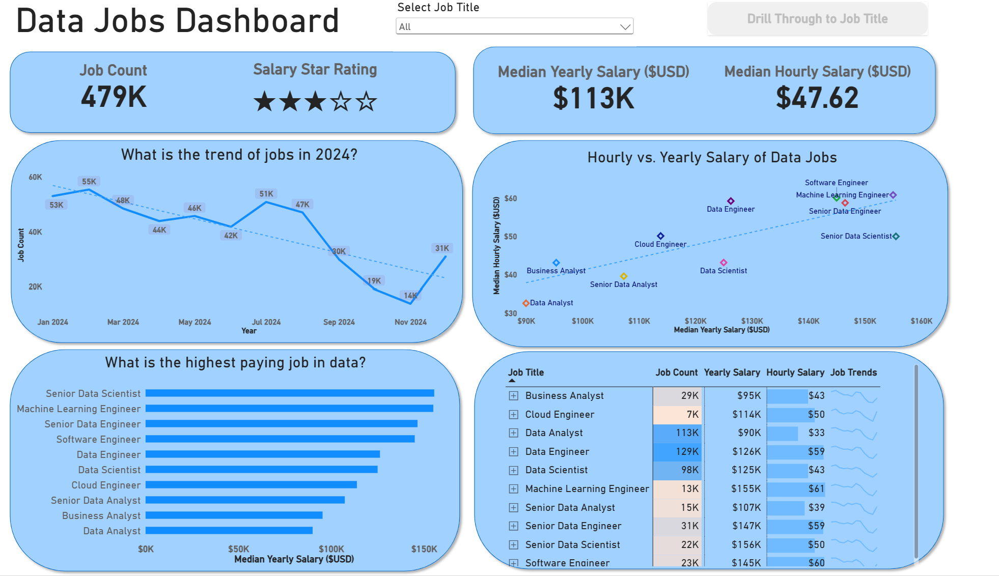
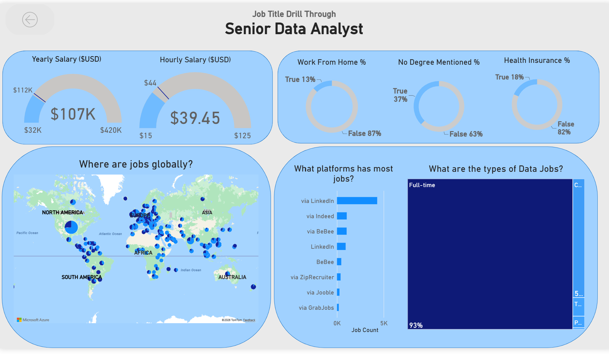

# Data Jobs Dashboard with Power BI

## Introduction

This dashboard was built for **job seekers, career changers, and professionals exploring new roles**, addressing a common pain point: information on the data job market is scattered across many sources and difficult to make sense of. *Drawing on a real-world dataset of 2024 data science job postings*, covering titles, salaries, and locations, this project brings that information into one  interface for exploring market trends and pay ranges.

## Skills Showcased

Building this dashboard involved hands-on practice with several core Power BI features. Below is a summary of what the project demonstrates:

-   **⚙️ Data Transformation (ETL) with Power Query:** Cleaned, shaped, and prepared the raw data for analysis, including handling missing values, adjusting data types, and creating calculated columns.
-   **🧮 DAX Measures:** Wrote measures to surface key insights and KPIs such as `Median Yearly Salary` and `Job Count`.
-   **📊 Core Visualizations:** Used **Column, Bar, Line, and Area Charts** to compare job counts and track trends over time.
-   **🗺️ Geospatial Analysis:** Applied **Map Charts** to show the global distribution of job postings.
-   **🔢 KPI Indicators and Tables:** Used **Cards** to display key metrics and **Tables** to provide detailed, sortable data.
-   **🎨 Dashboard Design:** Designed a clear and visually engaging layout, incorporating both common and less common chart types to tell the data story effectively.
-   **🖱️ Interactive Reporting:**
    -   **Slicers:** Enable dynamic filtering of the report by Job Title.
    -   **Buttons and Bookmarks:** Support a smooth navigation experience.
    -   **Drill-Through:** Allow users to move from a high-level summary to a detailed, contextual view.
---

## Dashboard Overview

### Page 1: High-Level Market View

This is your mission control for the data job market. It showcases key KPIs like total job count, median salaries, and top job titles to give you a quick understanding of what's happening in the job market at a glance.

### Page 2: Job Title Drill Through

 

This is the deep-dive page. From the main dashboard, you can drill through to this view to get specific details for a single job title, including salary ranges, work-from-home stats, top hiring platforms, and a global map of job locations.

---

## Conclusion

This dashboard demonstrates how Power BI can turn raw job posting data into a practical tool for career research. Users can filter, segment, and drill into the data to make informed decisions about their next career move.